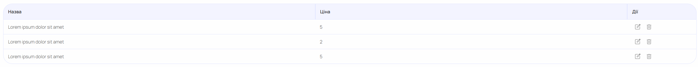

# NgxDataGridx Component Documentation

## Overview




**NgxDataGridx** is an Angular component that renders data in a highly customizable and interactive data table. It supports features such as filtering, sorting, pagination, CSV export, expandable sub-grids, and integration with Angular Material components.

🔗 **GitHub Repository**: [Trixwell/data-grid](https://github.com/Trixwell/data-grid)
---

## Installation

To use `NgxDataGridx`, ensure you have Angular and Angular Material installed. Then, import the component into your module:

```bash
npm install ngx-data-gridx
```

### Required peer dependencies:

```bash
npm install @angular/material @angular/forms @angular/common rxjs
```

**In your `app.module.ts`:**

```ts
import { NgxDataGridx } from 'ngx-data-gridx';

@NgModule({
  declarations: [AppComponent],
  imports: [NgxDataGridx],
  bootstrap: [AppComponent],
})
export class AppModule {}
```

---

## Inputs (`@Input`)

| Name                 | Type                                          | Description                                            |
| -------------------- | --------------------------------------------- |--------------------------------------------------------|
| `url`                | `string`                                      | API endpoint to load data from.                        |
| `exportCsvUrl`       | `string`                                      | URL to export the current filtered data in CSV format. |
| `data`               | `GridProperty[]`                              | Configuration for grid columns.                        |
| `limit`              | `number`                                      | Number of rows per page.                               |
| `sort`               | `string`                                      | Sort direction: `asc` or `desc`.                       |
| `sidx`               | `string`                                      | Field name to sort by.                                 |
| `grid_name`          | `string`                                      | Unique identifier for the grid.                        |
| `multiselect`        | `boolean`                                     | Enables row multi-selection.                           |
| `showFilters`        | `boolean`                                     | Toggle filter visibility.                              |
| `subUrlParams`       | `{ paramName: string; columnName: string }[]` | Parameters to pass to sub-grid requests.               |
| `currentRow`         | `object`                                      | Parent row context for sub-grid data.                  |
| `showHistoryFilters` | `boolean`                                     | Display history of applied filters.                    |
| `expandedElement`    | `object`                                      | Row currently expanded to show sub-grid.               |
| `noDataPlaceholder`  | `string`                                      | Message to display when no data is found.              |
| `parentGridFilters`  | `object`                                      | Filters from a parent grid to apply in a sub-grid context. |

---

## Key Methods

* `loadData(page, limit)` — Fetches data from `url` with filters, sorting, and pagination applied.
* `onFilterChange(column, type, label, value)` — Applies a filter to a column.
* `onDateRangeChange(column, formGroup)` — Applies date range filtering.
* `clearAllFilters()` — Resets all applied filters.
* `exportCsvAction()` — Initiates export of filtered data to CSV.
* `setCurrentGridColumn(column, row)` — Toggles sub-grid view for a row.

---

## Template Structure

* **Filter Controls**: Positioned above the table; supports input search, select, checkbox, and date-range.
* **Table Body**: Built with `<mat-table>`. Each column is defined using `matColumnDef`. Rows are populated using `MatTableDataSource`.
* **Expandable Rows**: Sub-grids can be rendered by expanding a row.
* **Actions**: Built-in buttons for filtering, clearing, and exporting.

Uses Angular Material components: `mat-table`, `mat-paginator`, `mat-form-field`, `mat-select`, `mat-checkbox`, `mat-icon`, `mat-progress-bar`, `mat-date-range-input`, etc.

---

## Animations & Interactions

* **Row Expansion**: Smooth expansion/collapse using Angular animations (`@detailExpand`).
* **Filtering**: Debounced reactive search using `Subject` + `debounceTime` for responsive UX.
* **Multi-select**: Row selection via `mat-checkbox`.
* **CSV Export**: Filtered results can be exported with one click.

---

## Example Usage

### Component Setup

```ts
@Component({
  selector: 'app-root',
  templateUrl: './app.component.html',
})
export class AppComponent {
  apiUrl = '/api/items';
  columnConfig: GridProperty[] = [
    new GridProperty({
      name: 'id',
      displayName: 'ID',
      type: GridPropertyType.Number,
      sort: true,
    }),
    new GridProperty({
      name: 'title',
      displayName: 'Title',
      type: GridPropertyType.Text,
      search: true,
    }),
    new GridProperty({
      name: 'category',
      displayName: 'Category',
      type: GridPropertyType.Text,
      filter: [
        { label: 'Category', type: 'select' },
      ],
      filterValues: [[
        { label: 'Books', value: 'books' },
        { label: 'Music', value: 'music' },
      ]],
    }),
    new GridProperty({
      name: 'created_at',
      displayName: 'Created',
      type: GridPropertyType.Date,
      filter: [
        { label: 'Date range', type: 'date' },
      ]
    }),
    new GridProperty({
      name: 'details',
      displayName: 'Details',
      type: GridPropertyType.Text,
      ident: true,
      subGridSettings: new SubGridSettings({
        suburl: '/api/items/details',
        subUrlParams: [{ paramName: 'item_id', columnName: 'id' }],
        subGridProps: {
          multiselect: false,
          limit: 5,
          search: true,
          showFilters: true
        }
      }),
      subGridPropertyList: [
        new GridProperty({
          name: 'detail_id',
          displayName: 'Detail ID',
          type: GridPropertyType.Number
        }),
        new GridProperty({
          name: 'description',
          displayName: 'Description',
          type: GridPropertyType.Text
        })
      ]
    })
  ];
}
```

### Template

```html
<ngx-data-gridx
  [url]="apiUrl"
  [data]="columnConfig"
  [limit]="10"
  sidx="created_at"
  sort="desc"
  [multiselect]="true"
  [showFilters]="true"
  grid_name="ExampleGrid">
</ngx-data-gridx>
```

---
